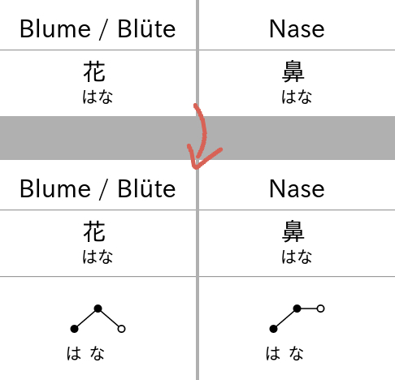

Script to automatically add pitch accent information to an Anki deck.

### Usage
* `$ python3 anki_add_pitch.py /path/to/collection.anki2` to add pitch accent info
* `$ python3 remove_pitch.py /path/to/collection.anki2` to remove pitch accent info

### Example

### Notes
* generates accent notation similar to [大辞林 アクセント解説](https://www.sanseido-publ.co.jp/publ/dicts/daijirin_ac.html)
* assumes your Anki cards' *first* and *third* field to contain a word and its reading respectively (e.g. expression, meaning, reading)
* `wadoku_pitchdb.tsv` was generated from a [Wadoku XML dump](https://www.wadoku.de/wiki/display/WAD/Downloads+und+Links) (see file `wadoku_parse.py`)
