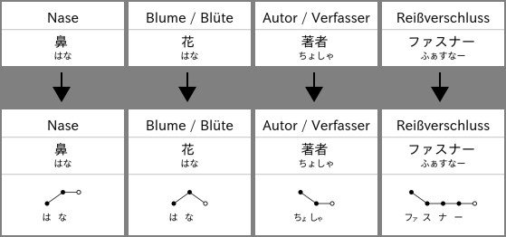

Script to automatically add pitch accent information to an Anki deck.

### Usage
* `$ python3 anki_add_pitch.py /path/to/collection.anki2` to add pitch accent info
* `$ python3 remove_pitch.py /path/to/collection.anki2` to remove pitch accent info

### Example

### Notes
* generates accent notation similar to [大辞林 アクセント解説](https://www.sanseido-publ.co.jp/publ/dicts/daijirin_ac.html)
* assumes your Anki cards' *first* and *third* field to contain a word and its reading respectively (e.g. expression, meaning, reading)
* `accdb_minimal.tsv` was generated using `ACCDB_unicode.csv` from [javdejong/nhk-pronunciation](https://github.com/javdejong/nhk-pronunciation/blob/master/ACCDB_unicode.csv) (see file `strip_javdejong_nhk-pronunciation.py`)
